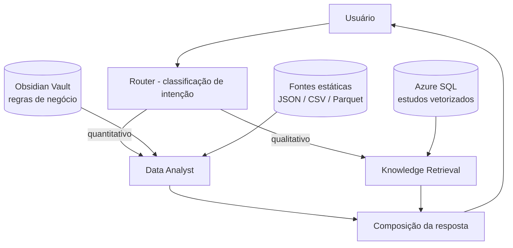

# Agente de IA do Observatório de Negócios — Sebrae/SC

Agente corporativo de dupla função para consultas quantitativas e qualitativas
sobre a base de conhecimento do Observatório de Negócios, construído em
**LangGraph** e hospedado no **Microsoft Foundry**.

---

## Visão geral

O agente opera em duas frentes com escopos estritamente delimitados:

| Frente | Função | Fonte |
|---|---|---|
| **Data Analyst** | Consultas quantitativas determinísticas | Fontes estáticas estruturadas + regras do Obsidian |
| **Knowledge Retrieval** | Recuperação contextual de estudos | Azure SQL com busca vetorial |

### Princípio arquitetural

> **O Obsidian diz COMO calcular.**
> **As fontes estruturadas contêm OS NÚMEROS.**
> **O Azure SQL contém OS ESTUDOS.**
> **O LangGraph decide PARA ONDE enviar a pergunta.**

O LLM interpreta e redige; ferramentas determinísticas calculam. Em nenhum
momento o modelo gera código de agregação ou inventa valores numéricos.

---

## Arquitetura



### Ciclo de execução

```text
Inputs → Perception → Cognition → Action → Output
```

1. **Perception** — classificação da intenção e extração de entidades
   (indicador, município, regional, porte, ano, tema)
2. **Cognition** — leitura das regras de negócio aplicáveis no Vault antes
   de qualquer cálculo ou recuperação
3. **Action** — agregação determinística em pandas **ou** busca vetorial
   com `VECTOR_DISTANCE`
4. **Output** — resposta com métrica, escopo, fonte, data de referência e
   estudos consultados

---

## Stack

| Camada | Tecnologia |
|---|---|
| Orquestração | LangGraph (`StateGraph`) |
| Hospedagem | Microsoft Foundry (`ResponsesHostServer`) |
| LLM | Foundry — modelo configurável por deployment |
| Embeddings | `text-embedding-3-small` (1536 dimensões) |
| Vector store | Azure SQL Database — tipo `VECTOR` nativo |
| Regras de negócio | Obsidian Vault (Markdown + frontmatter YAML) |
| Dados quantitativos | JSON / CSV / Parquet em formato tidy |

---

## Estrutura do projeto

```text
odn-ai-agent/
│
├── src/observatorio_agent/
│   │
│   ├── main.py                      # entrypoint e construção do grafo
│   ├── test_graph.py                # execução local sem servidor
│   │
│   ├── graph/
│   │   ├── state.py                 # AgentState (TypedDict)
│   │   └── nodes/
│   │       ├── router.py            # classificação de intenção
│   │       ├── data_analyst.py      # ramo quantitativo
│   │       ├── rag_retriever.py     # ramo qualitativo
│   │       └── response.py          # composição final
│   │
│   ├── services/
│   │   ├── obsidian/vault_loader.py # leitura das regras de negócio
│   │   ├── datasets/static_loader.py# consulta determinística em pandas
│   │   ├── chunking.py              # divisão dos estudos por headings
│   │   └── ingest_db_vector.py      # pipeline de ingestão vetorial
│   │
│   ├── vault/                       # Obsidian — regras e indicadores
│   │   ├── indicadores/
│   │   ├── regras/
│   │   ├── dicionarios/
│   │   └── fontes/
│   │
│   ├── data/indicadores/            # fontes estáticas quantitativas
│   └── estudos/                     # estudos em Markdown
│
├── requirements.txt
└── README.md
```

---

## Instalação

### Pré-requisitos

- Python 3.11 ou 3.12
- ODBC Driver 18 for SQL Server
- Acesso ao Azure SQL (`odn-database`)
- Recurso Microsoft Foundry provisionado

```powershell
winget install Microsoft.msodbcsql.18
```

### Ambiente

```powershell
python -m venv .venv
.\.venv\Scripts\Activate.ps1
pip install -r requirements.txt
```

### Variáveis de ambiente

Crie um arquivo `.env` na raiz de `src/observatorio_agent/`:

```text
# Foundry
FOUNDRY_PROJECT_ENDPOINT=https://<recurso>.services.ai.azure.com
OPEN_AI_ENDPOINT=<endpoint do modelo>
FOUNDRY_API_KEY=<chave>
AZURE_AI_MODEL_DEPLOYMENT_NAME=<deployment do chat>
AZURE_EMBEDDING_DEPLOYMENT=text-embedding-3-small

# Azure SQL
AZURE_SQL_CONNECTION_STRING=Driver={ODBC Driver 18 for SQL Server};Server=tcp:<servidor>.database.windows.net,1433;Database=odn-database;Authentication=ActiveDirectoryInteractive;Encrypt=yes;TrustServerCertificate=no;Connection Timeout=30;

# Caminhos (opcionais)
OBSIDIAN_VAULT_PATH=./vault
STATIC_DATA_PATH=./data/indicadores
ESTUDOS_PATH=./estudos
```

> **Credenciais:** prefira `Authentication=ActiveDirectoryInteractive` a
> `Uid`/`Pwd`. Em produção, utilize Managed Identity com os segredos no
> Azure Key Vault.

---

## Uso

### Teste local (sem servidor)

```powershell
python test_graph.py
```

### Servidor Foundry

```powershell
python main.py
```

O agente sobe em `http://0.0.0.0:8088` pelo protocolo Responses.

### Ingestão dos estudos

```powershell
python services/ingest_db_vector.py            # incremental
python services/ingest_db_vector.py --forcar   # reprocessa tudo
```

A ingestão é **idempotente**: documentos cujo conteúdo não mudou são
ignorados, evitando custo desnecessário de embedding.

---

## Base de conhecimento

### Obsidian Vault — regras de negócio

Cada indicador é uma nota Markdown com frontmatter YAML:

```yaml
---
indicador: empresas_ativas
title: Empresas ativas
fonte: vw_empresas
dominio: empresas
status: approved
agregacao: estabelecimento
tags: [empresas, estabelecimentos]
---

# Empresas ativas

Quantidade de estabelecimentos ativos na data de referência.

## Filtros obrigatórios
- situacao = 'ATIVA'
- informar sempre a data de referência

## Restrições
- não somar arquivos com datas de referência distintas
```

Apenas notas com `status: approved` orientam respostas produtivas. Notas
marcadas como `deprecated` permanecem no histórico, mas são ignoradas.

### Fontes estáticas — formato tidy

Uma linha por município × porte × período:

```json
{
  "codigo_ibge": "4205407",
  "municipio": "Florianópolis",
  "regional": "Grande Florianópolis",
  "porte": "MEI",
  "data_referencia": "2026-06-30",
  "fonte": "Receita Federal - CNPJ",
  "total": 78450
}
```

O formato longo permite incluir setor, CNAE e série histórica sem alterar
o código de consulta.

### Estudos — Markdown com frontmatter

```yaml
---
title: Panorama das MPEs em Santa Catarina
ano: 2026
tema: [economia, empresas]
regional: Grande Florianópolis
fonte: Observatório de Negócios - Sebrae/SC
data_referencia: 2026-Q1
---
```

O chunking divide por headings (`#`, `##`, `###`), preserva tabelas
íntegras e mantém o caminho hierárquico de cada trecho para citação.

---

## Guardrails

- **Sem cálculo pelo LLM** — toda agregação é executada em Python; o modelo
  apenas extrai parâmetros e redige
- **Localidade desconhecida** — município ou regional ausente da fonte
  retorna mensagem explícita, nunca o total do estado
- **Ausência ≠ zero** — a distinção é sempre declarada na resposta
- **Corte de relevância** — trechos acima da distância máxima são
  descartados, acionando o fallback padrão
- **Citação obrigatória** — toda resposta indica os estudos e as regras que
  a fundamentam
- **Escopo delimitado** — perguntas fora do domínio do Observatório são
  recusadas com texto padronizado

---

## Roadmap

### Fase 1 — MVP (concluída)

- [x] Grafo LangGraph com roteamento de intenção
- [x] Leitura de regras de negócio do Obsidian
- [x] Consultas quantitativas por município, regional e porte
- [x] Vetorização dos estudos no Azure SQL
- [x] Busca semântica com `VECTOR_DISTANCE`

### Fase 2 — Confiabilidade

- [ ] Conjunto de perguntas douradas para regressão
- [ ] Métricas de precisão e cobertura
- [ ] Logs estruturados e rastreabilidade por execução
- [ ] Validação de reconciliação entre totais

### Fase 3 — Inteligência

- [ ] Consultas híbridas (quantitativo + qualitativo)
- [ ] Self-correction loop
- [ ] Reranking dos trechos recuperados
- [ ] Índice DiskANN quando o acervo justificar

---

## Solução de problemas

| Sintoma | Causa provável | Correção |
|---|---|---|
| `CERTIFICATE_VERIFY_FAILED` | Inspeção TLS corporativa | Registrar a CA no bundle do `certifi` |
| Timeout na porta 1433 | Zscaler ou firewall | Verificar exceção no cliente de rede |
| `TcpTestSucceeded: False` com ping OK | Acesso público desabilitado no servidor | Private endpoint — alinhar com a TI |
| Dimensão incompatível no `CAST` | Deployment de embedding incorreto | Usar modelo de 1536 dimensões |
| Resposta com total do estado inesperado | Município ausente da fonte | Conferir grafia e cobertura do dataset |

---

## Governança

- Dados classificados como **uso interno**
- Nenhum dado pessoal identificável é indexado ou retornado
- Respostas fundamentadas exclusivamente em conteúdo validado pelo
  Observatório de Negócios
- Atualização da base de conhecimento conforme publicação de novos estudos

---

**Observatório de Negócios — Sebrae/SC**
Gerência de Gestão Estratégica
